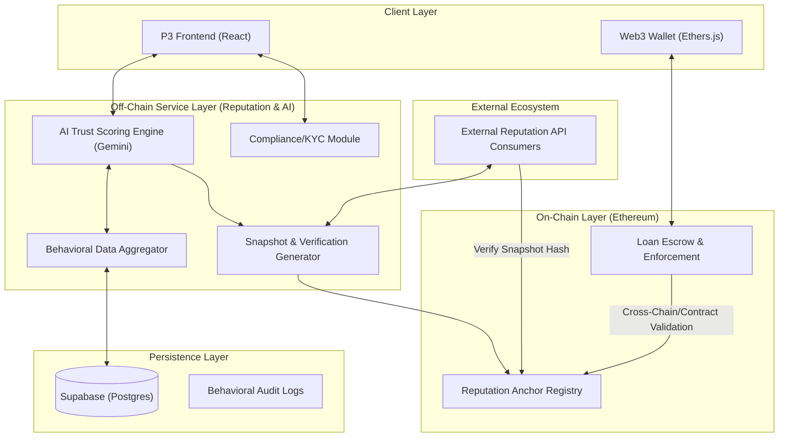

# P3 Lending Protocol: Infrastructure Architecture

This document outlines the distributed system architecture and service boundaries for the P3 Lending Protocol, a hybrid Web2/Web3 reputation-based lending marketplace.

## 1. High-Level Architecture Diagram

## 2. Service & Module Boundaries

### A. AI Trust Scoring Engine (Off-Chain)
*   **Responsibility**: The primary "brain" of the protocol. It computes the P3 Reputation Score based on a combination of financial metrics and qualitative behavioral signals.
*   **Key Functions**:
    *   **Behavioral Synthesis**: Analyzing app interaction logs (trust signals like mentorship, responsiveness).
    *   **Fairness Normalization**: Adjusting scores to ignore historical "hardship" if current repayment streaks are positive.
    *   **Recommendation Engine**: Suggesting optimal loan terms for lenders based on borrower risk profiles.

### B. Hash Anchoring & Snapshots (Integrity Layer)
*   **Responsibility**: Bridges the trust gap between off-chain AI computation and on-chain enforcement.
*   **Key Functions**:
    *   **Snapshot Generation**: Encapsulates a user's score and "merit evidence" into a signed JSON-LD record.
    *   **On-Chain Anchoring**: Commits the cryptographic hash of the snapshot to the `ReputationAnchorRegistry` contract on Ethereum.
    *   **Proof Generation**: Provides Merkle proofs or cryptographic signatures to the frontend for use in smart contract calls.

### C. Loan Enforcement (On-Chain)
*   **Responsibility**: Trustless management of capital and conditional release of funds.
*   **Key Functions**:
    *   **Escrow Vault**: Standardized contract for locking lender ETH/Stablecoins.
    *   **Eligibility Check**: Queries the `ReputationAnchorRegistry` to verify if a borrower meets the minimum reputation requirements before allowing fund withdrawal.
    *   **Repayment Signal**: Emits events that are indexed back into the *Data Aggregator* to update the user's score.

### D. Reputation API Gateway (External Integration)
*   **Responsibility**: Future-proofing the protocol as a general-purpose reputation utility for other DeFi/Web3 platforms.
*   **Key Functions**:
    *   **Verification Interface**: Allows 3rd parties to submit a SNAPSHOT and verify it against the on-chain HASH.
    *   **SDK/Middleware**: Provides standard interfaces for external protocols to "gate" their own features based on P3 trust scores.
